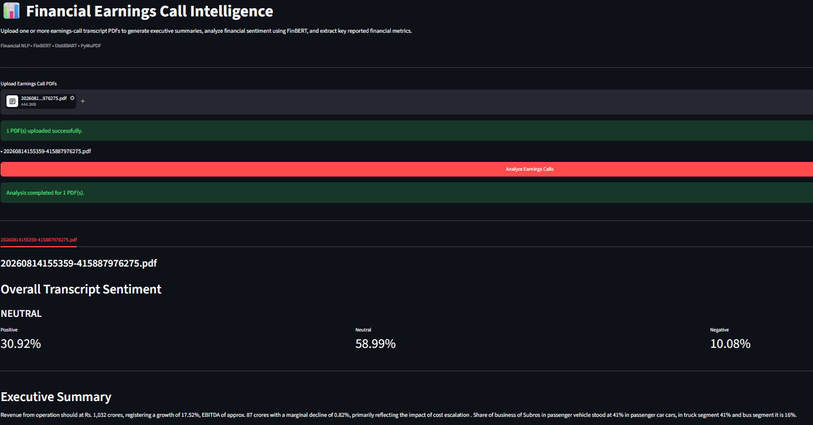
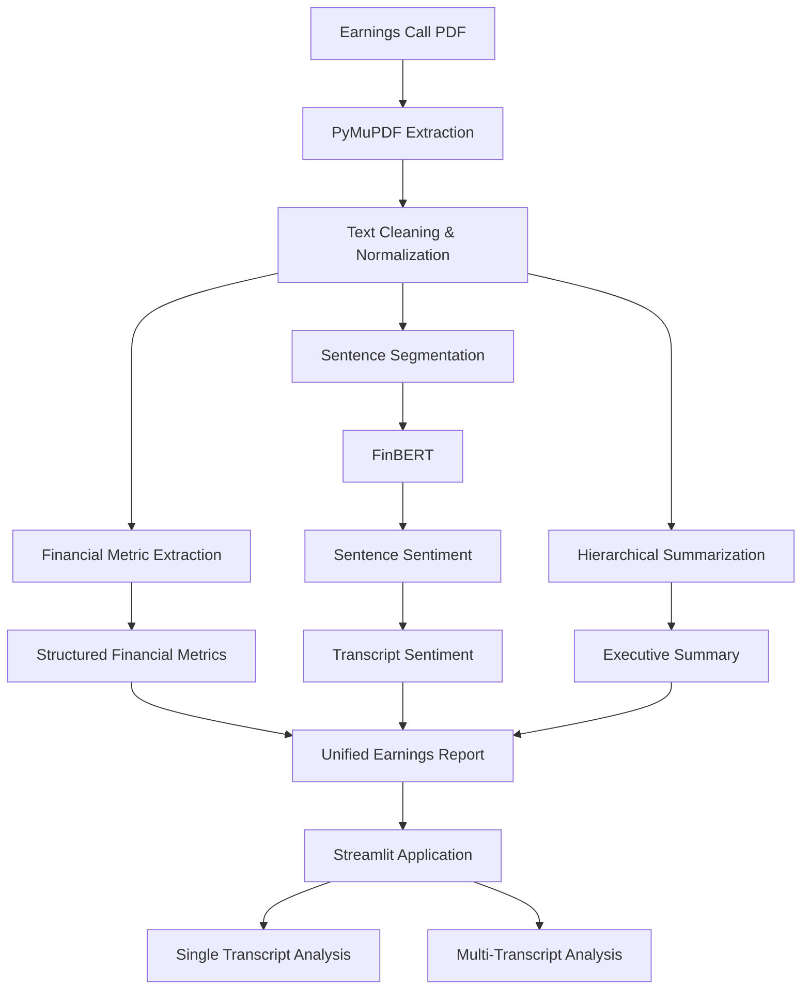
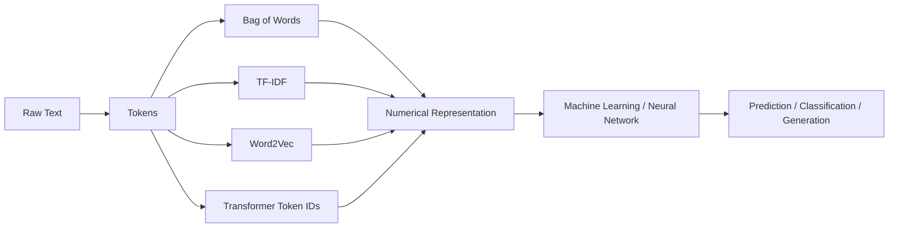

# 📊 Financial Earnings Call Intelligence

> An end-to-end NLP application that converts earnings-call transcript PDFs into structured financial insights using classical NLP, rule-based information extraction, FinBERT sentiment analysis, and transformer-based summarization.

<p align="center">
  <b>PDF → Text Extraction → Financial Metrics → Sentiment → Summarization → Multi-Call Analysis</b>
</p>

---

## 🚀 Overview

Financial earnings calls contain valuable information about:

- Revenue and profitability
- Management commentary
- Business growth
- Margins
- Guidance
- Risks
- Segment performance
- Investor questions

However, earnings-call transcripts are long, conversational, and difficult to analyze manually.

**Financial Earnings Call Intelligence** converts raw earnings-call PDFs into a structured report containing:

- 📌 Key financial metrics
- 🧠 Overall transcript sentiment
- 📊 Sentence-level FinBERT sentiment
- 📝 Abstractive executive summaries
- 📚 Multi-transcript analysis
- 🔎 Extracted transcript for traceability

The project was built primarily to understand the **complete NLP pipeline underneath modern AI systems**, from raw text processing and numerical representations to transformer inference and deployment.

---

## 🌐 Live Application

> Streamlit deployment will be added here after deployment.

**Live Demo:** `https://financial-earnings-nlp.streamlit.app/`

**GitHub Repository:** `https://github.com/Krushang010/financial-earnings-nlp.git`

---

## 🖼️ Application Preview

> 

Recommended screenshots:

1. PDF upload interface
2. Overall sentiment result
3. Executive summary
4. Financial metrics table
5. Multi-quarter comparison

---

# ✨ Features

### 📄 PDF Transcript Processing

Upload one or multiple earnings-call transcript PDFs.

The application uses **PyMuPDF** to:

- extract text page-by-page
- ignore exchange cover pages
- remove page-number artifacts
- normalize transcript text
- prepare the text for NLP processing

---

### 💰 Financial Metric Extraction

Important financial values are extracted using deterministic, finance-aware regular expressions.

Current supported metrics include:

| Metric | Example |
|---|---|
| Revenue | ₹1,604 crore |
| Export Revenue | ₹335 crore |
| Gross Margin | 27.4% |
| Operating EBITDA | ₹162 crore |
| EBITDA Margin | 11.9% |
| PBT | ₹150 crore |
| PBT Margin | 9.2% |
| PAT | ₹119 crore |
| PAT Margin | 8.1% |

The extractor intentionally returns `None` when a metric cannot be confidently identified instead of fabricating a value.

---

### 🧠 Financial Sentiment Analysis

The application uses:

**`ProsusAI/finbert`**

FinBERT performs sentence-level financial sentiment classification into:

- Positive
- Neutral
- Negative

Instead of displaying only hundreds of sentence predictions, the application aggregates the model probabilities to generate an overall transcript sentiment.

Example:

```text
Overall Sentiment: NEUTRAL

Positive : 31.60%
Neutral  : 61.46%
Negative :  6.94%
```

The complete sentence-level predictions remain available inside the Streamlit interface.

---

### 📝 Hierarchical Transformer Summarization

Earnings-call transcripts are much longer than the input limit of standard transformer summarization models.

The project therefore implements **hierarchical summarization** using:

**`sshleifer/distilbart-cnn-12-6`**

Instead of truncating the transcript:

```text
Full Transcript
      ↓
Sentence Segmentation
      ↓
Token-aware Chunks
      ↓
Chunk Summaries
      ↓
Recursive Summary Reduction
      ↓
Executive Summary
```

This allows long earnings calls to be summarized while staying within the model's context limit.

---

### 📚 Multi-PDF Earnings Analysis

The Streamlit application also accepts multiple earnings-call transcripts.

Each PDF is analyzed independently:

```text
Transcript 1
     ↓
Metrics + Sentiment + Summary

Transcript 2
     ↓
Metrics + Sentiment + Summary

Transcript 3
     ↓
Metrics + Sentiment + Summary
```

The results are then combined into a multi-call view containing:

- Combined sentiment
- Financial metric comparison
- Individual call summaries
- Chronological earnings-call analysis

---

# 🏗️ System Architecture



---

# 🧠 NLP Learning Journey

The production application is only one part of the project.

The accompanying notebook documents the progression from **classical NLP to transformer-based NLP**.

<details>

<summary><b>1️⃣ Text Extraction & Preprocessing</b></summary>

<br>

The project starts from raw earnings-call PDFs.

Topics explored:

- PDF text extraction
- page-level processing
- structural cleaning
- line-wrap repair
- text normalization
- speaker detection
- section-heading identification
- raw vs cleaned vs processed text

One important design decision was to preserve different text representations rather than repeatedly overwriting the original transcript.

```text
raw_text
    ↓
clean_text
    ↓
processed_text
```

</details>

---

<details>

<summary><b>2️⃣ Tokenization, POS & Linguistic Processing</b></summary>

<br>

Compared multiple tokenization approaches using:

- NLTK
- spaCy

Studied:

- sentence tokenization
- word tokenization
- stopword removal
- stemming
- lemmatization
- part-of-speech tagging

Financial text exposed several domain-specific challenges.

For example:

```text
Rs. 960 crores
Q1 FY26
EBITDA
year-on-year
```

do not always behave cleanly under generic tokenizers.

</details>

---

<details>

<summary><b>3️⃣ Bag of Words & N-Grams</b></summary>

<br>

Implemented classical sparse text representations using:

- Bag of Words
- Unigrams
- Bigrams
- Trigrams

This demonstrated a fundamental limitation of Bag of Words:

```text
Revenue increased profit
Profit increased revenue
```

can produce identical representations despite having different word order.

N-grams partially restore local context but significantly increase dimensionality.

</details>

---

<details>

<summary><b>4️⃣ TF-IDF</b></summary>

<br>

Applied TF-IDF across earnings-call transcripts to understand how term importance changes across documents.

The experiment showed that TF-IDF:

- reduces the weight of common vocabulary
- identifies relatively distinctive terms
- does not understand semantic meaning
- can still rank conversational transcript noise highly

</details>

---

<details>

<summary><b>5️⃣ Topic Modelling — LDA & NMF</b></summary>

<br>

Implemented:

### Latent Dirichlet Allocation

Count-based probabilistic topic modelling.

### Non-negative Matrix Factorization

TF-IDF-based matrix factorization.

Topics included themes such as:

- working capital
- profitability
- PCB / CAPEX
- growth
- order book

The models generate groups of related words; human interpretation is still required to assign meaningful business labels.

</details>

---

<details>

<summary><b>6️⃣ Word Embeddings — Word2Vec</b></summary>

<br>

Implemented Word2Vec using Gensim.

Both architectures were explored:

### CBOW

```text
Context → Target Word
```

### Skip-Gram

```text
Target Word → Context
```

Example learned relationships included:

```text
working ↔ capital
order ↔ book
PCB ↔ project
margin ↔ EBITDA
```

This demonstrated the transition from sparse representations to dense semantic vectors.

</details>

---

<details>

<summary><b>7️⃣ Classical Sentiment — VADER</b></summary>

<br>

VADER was first used as a baseline sentiment model.

It worked reasonably well for generic language but struggled with financial meaning.

For example:

```text
Working capital increased.
```

may appear linguistically positive while being financially undesirable depending on the context.

This motivated moving to a finance-domain transformer model.

</details>

---

<details>

<summary><b>8️⃣ Named Entity Recognition & Financial Extraction</b></summary>

<br>

spaCy NER was tested for extracting entities such as:

- Organizations
- Dates
- Percentages
- Numeric values

Generic NER also produced domain errors.

For example:

```text
PAT
```

could incorrectly be classified as a person.

For important structured financial fields, deterministic extraction was therefore used alongside NLP.

This became the basis of the hybrid architecture:

```text
Rules → precise financial values

Transformers → contextual NLP tasks
```

</details>

---

<details>

<summary><b>9️⃣ Extractive Summarization</b></summary>

<br>

A TF-IDF sentence-ranking baseline was implemented first.

The initial approach often selected sentences that contained important vocabulary but were poor summaries.

A centroid-based approach improved the result but remained extractive:

```text
Existing sentences → ranked → selected
```

It could not synthesize new language or combine information across the transcript.

</details>

---

<details>

<summary><b>🔟 FinBERT</b></summary>

<br>

Moved from classical sentiment to:

```text
ProsusAI/finbert
```

The project explores:

- subword tokenization
- contextual embeddings
- BERT architecture
- attention masks
- classification logits
- softmax probabilities
- batch inference
- GPU acceleration

FinBERT predictions were compared against VADER on thousands of real transcript sentences.

A key lesson:

> Contextual language understanding does not automatically equal financial reasoning.

Even a finance-domain transformer may misinterpret business impact when the meaning depends on whether a metric increasing is economically favorable or unfavorable.

</details>

---

<details>

<summary><b>1️⃣1️⃣ Transformer Summarization</b></summary>

<br>

Implemented abstractive summarization using DistilBART.

A standard transformer cannot directly process an entire earnings-call transcript because of token limits.

The project therefore implements hierarchical summarization:

```text
Transcript
    ↓
Chunks
    ↓
Chunk Summaries
    ↓
Summary Chunks
    ↓
Final Summary
```

</details>

---

# 🔢 From Text to Numbers

One of the main learning objectives of this project was understanding how machine-learning systems process language.

Computers do not directly operate on words such as:

```text
Revenue increased significantly
```

Language must first be converted into numerical representations.

The project explores this evolution:



Classical NLP uses manually designed representations such as word frequencies and TF-IDF.

Modern transformers learn contextual numerical representations where the representation of a word depends on the surrounding text.

---

# 🧩 Production Project Structure

```text
financial_earnings_nlp/
│
├── .streamlit/
│   └── config.toml
│
├── data/
│   ├── raw/
│   └── processed/
│
├── notebooks/
│   └── 01_pdf_extraction.ipynb
│
├── outputs/
│
├── src/
│   ├── __init__.py
│   ├── financial_extractor.py
│   ├── multi_report.py
│   ├── pdf_processor.py
│   ├── pipeline.py
│   ├── sentiment_analyzer.py
│   └── summarizer.py
│
├── app.py
├── requirements.txt
├── runtime.txt
├── README.md
└── .gitignore
```

### Module Responsibilities

| Module | Responsibility |
|---|---|
| `pdf_processor.py` | PDF extraction and transcript cleaning |
| `financial_extractor.py` | Rule-based financial metric extraction |
| `sentiment_analyzer.py` | FinBERT sentence and transcript sentiment |
| `summarizer.py` | Hierarchical DistilBART summarization |
| `multi_report.py` | Multi-transcript comparison |
| `pipeline.py` | End-to-end orchestration |
| `app.py` | Streamlit user interface |

---

# ⚙️ Installation

### 1. Clone the repository

```bash
git clone <YOUR_REPOSITORY_URL>
cd financial_earnings_nlp
```

### 2. Create a virtual environment

```bash
python -m venv .venv
```

### Windows

```bash
.venv\Scripts\activate
```

### macOS / Linux

```bash
source .venv/bin/activate
```

### 3. Install dependencies

```bash
pip install -r requirements.txt
```

### 4. Run the application

```bash
streamlit run app.py
```

Then open:

```text
http://localhost:8501
```

---

# 🖥️ Usage

### Single Earnings Call

1. Upload an earnings-call PDF.
2. Click **Analyze Earnings Calls**.
3. View:
   - overall sentiment
   - executive summary
   - financial metrics
   - sentence sentiment
   - extracted transcript

### Multiple Earnings Calls

Upload multiple PDFs simultaneously.

The application will:

1. analyze each transcript independently
2. extract individual financial metrics
3. calculate transcript sentiment
4. generate individual summaries
5. compare results across transcripts

---

# 🛠️ Technology Stack

### NLP & Machine Learning


### Application


### Models

- `ProsusAI/finbert`
- `sshleifer/distilbart-cnn-12-6`

### Classical NLP Explored

- NLTK
- Bag of Words
- N-grams
- TF-IDF
- LDA
- NMF
- Word2Vec
- VADER
- spaCy NER
- Extractive summarization

---

# 📊 Example

For one earnings-call transcript, the application produced:

```text
Overall Transcript Sentiment
----------------------------
NEUTRAL

Positive : 31.60%
Neutral  : 61.46%
Negative :  6.94%
```

Example extracted financial metrics:

```text
Revenue : ₹1,604 crore
EBITDA  : ₹162 crore
PBT     : ₹141 crore
PAT     : ₹106 crore
```

These examples demonstrate application output and **should not be interpreted as model accuracy metrics**.

---

# 🧪 Model Evaluation Philosophy

The earnings-call dataset used for this project does not contain human-labelled sentiment classes or expert-written reference summaries.

Therefore, the project deliberately does **not** report unsupported metrics such as:

```text
Accuracy
F1 Score
ROUGE
```

without ground truth.

Instead:

### Sentiment

FinBERT was compared qualitatively against a VADER baseline across real transcript sentences.

### Financial Extraction

Extracted values were manually checked against the original transcript.

### Summarization

Generated summaries were evaluated for:

- factual consistency
- business relevance
- information coverage
- readability

This keeps the project evaluation transparent and avoids claiming accuracy that cannot be measured reliably.

---

# ⚠️ Limitations

This application is an educational NLP project and not a professional financial research platform.

Current limitations include:

- Rule-based financial extraction depends on transcript phrasing.
- Similar metrics from quarterly, annual, historical, and guidance statements can require additional disambiguation.
- FinBERT measures linguistic financial sentiment and does not independently understand every business implication.
- DistilBART can omit important numerical information during compression.
- Generated summaries may contain wording or attribution errors.
- No supervised fine-tuning was performed because labelled training data was not available.
- Financial outputs should always be verified against original company disclosures.

---

# 🔮 Future Improvements

This project intentionally stops before introducing an LLM/RAG layer.

Possible future extensions include:

- Retrieval-Augmented Generation (RAG)
- Vector database for transcript search
- Semantic earnings-call Q&A
- LLM-based structured extraction
- Evidence-backed summaries with source references
- Management vs analyst sentiment
- Guidance tracking across quarters
- Automated financial trend detection
- Speaker-aware analysis
- Earnings-call comparison dashboards

A future architecture could look like:

```text
Financial Documents
        ↓
NLP Processing
        ↓
Chunking + Embeddings
        ↓
Vector Database
        ↓
Retriever
        ↓
LLM
        ↓
Financial Research Assistant
```

The NLP concepts explored in this project provide the foundation for that architecture.

---

# 🎯 Key Learning Outcomes

This project helped develop practical understanding of:

- how raw language becomes numerical representations
- sparse vs dense text representations
- static vs contextual embeddings
- tokenization and subword tokenization
- classical NLP vs transformer NLP
- information extraction using regex and NER
- domain-specific sentiment analysis
- long-document transformer limitations
- hierarchical summarization
- GPU-based transformer inference
- multi-document processing
- NLP application architecture
- Streamlit deployment
- separating experimentation code from production code

---

# 🔐 Data

The original earnings-call PDFs are **not included in this repository**.

The application is designed to accept user-uploaded earnings-call PDFs at runtime.

This keeps the repository focused on the NLP implementation rather than distributing source documents.

---

# 📌 Disclaimer

This project is built for educational and portfolio purposes.

Model-generated sentiment and summaries may contain errors or omit relevant financial information.

The application does **not** provide investment advice.

Always verify financial information using official company filings, earnings releases, and investor disclosures.

---

## 👤 Author

**Krushang Patel**

Data Analyst transitioning into Data Science, with a focus on:

- Machine Learning
- NLP
- Forecasting
- Financial Analytics
- Applied AI

---

<p align="center">
  Built to understand NLP from classical text representations to transformer-powered financial intelligence.
</p>